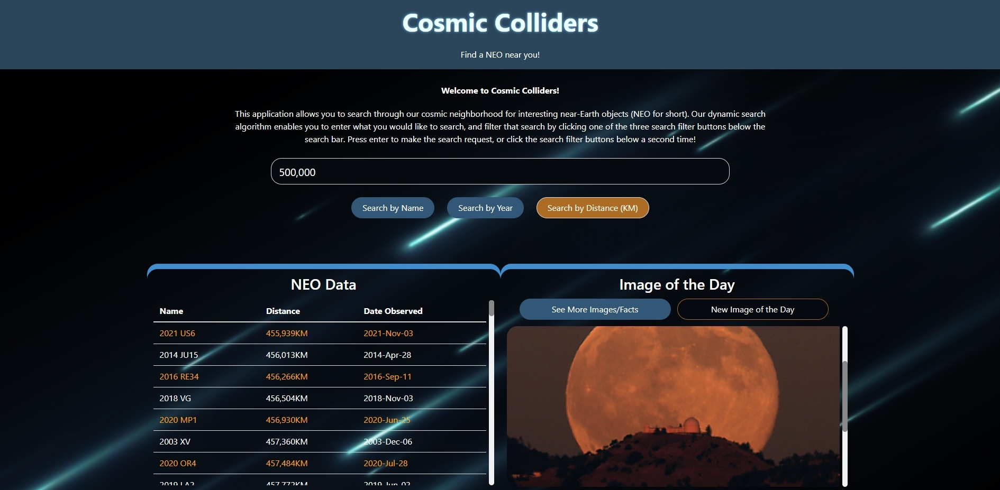

# Cosmic Colliders

Welcome to Cosmic Colliders! The web application that allows you to traverse the vast database of Near-Earth Objects (NEOs). 

This application brings a dynamic search functionality to NEO research, allowing you to filter NEOs by name, date, and distance away from Earth! There is also a dedicated section of the page displaying a space image of the day, along with a detailed historical description about that image!

To investigate our deployed application, **click the banner image below**

# Technical Challenges

There were several technical challenges we faced during the initial development of this project which accounted for most of the time spent working. The main ones include:

* API CORS errors
* Learning Bulma (and other technologies) in just a few days
* Creating and implementing a custom search engine
* Creating and implementing custom UI
* And more

We are happy to boast that while these challenges were difficult at times, none of them were able to stop us in ultimately accomplishing our goal before our deadline!

# Technologies Used

Of course, this project would not be made possible without the use of the following free technologies we've implemented:

* [Javascript](https://www.javascript.com/)/[jQuery](https://jquery.com/)
* [CSS](https://www.w3.org/Style/CSS/Overview.en.html)/[Bulma](https://bulma.io/)
* [NASA CAD API](https://ssd-api.jpl.nasa.gov/doc/cad.html)
* [NASA APOD API](https://api.nasa.gov/#apod)

# What's to Come?

While Cosmic Colliders is a functioning and responsive application, it is still an ongoing project with many more features to come in the future. The project will remain a collaborative effort, and we may even recruit some new developers along the way!

What to expect from us in the future:

* A more responsive and polished UI design
* SEO (Search Engine Optimization)
* Math calculations for providing additional NEO info
* And more

# Contributors

Cosmic Colliders was a team effort brought to you by the following contributors:

* James Primitive (Christopher J. Hoke)
    - Programmer (Javascript)
    - Troubleshooter
    - API Wizard

- Amy Nikitas
    - Designer
    - HTML/CSS Developer
    - Color Artist

* Gabrielle Befort
    - Designer
    - HTML/CSS Developer
    - Bulma Implementor

- William J. Horn
    - Programmer (Javascript)
    - Troubleshooter
    - UI Integration
